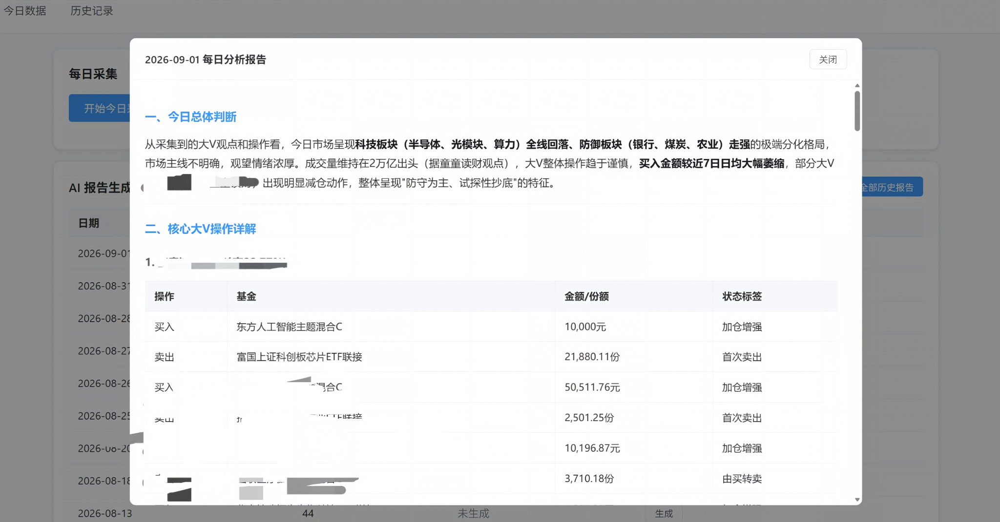
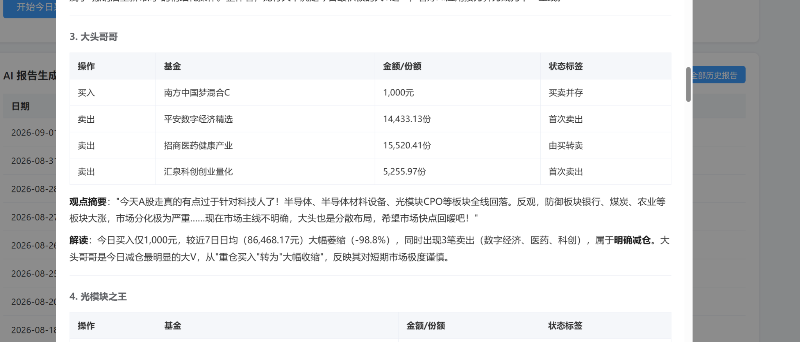
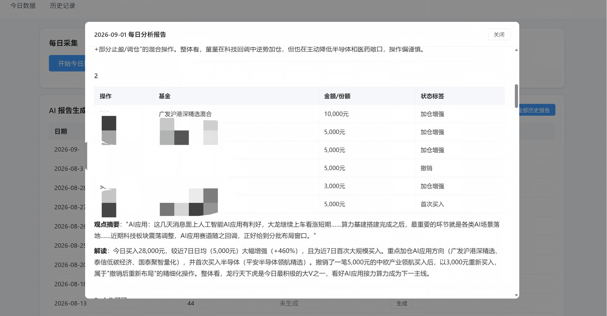
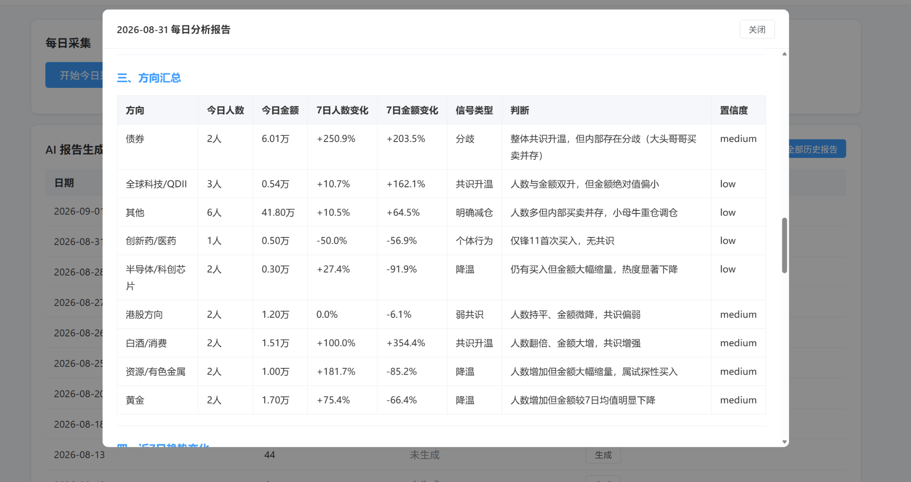
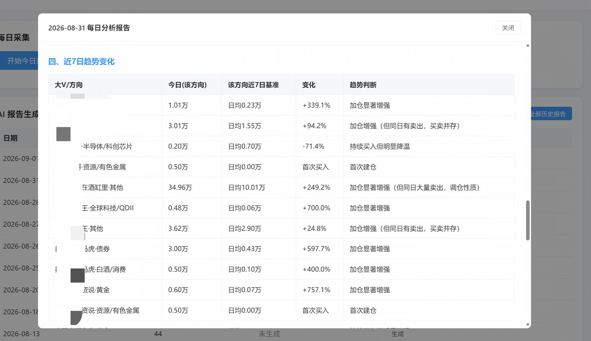
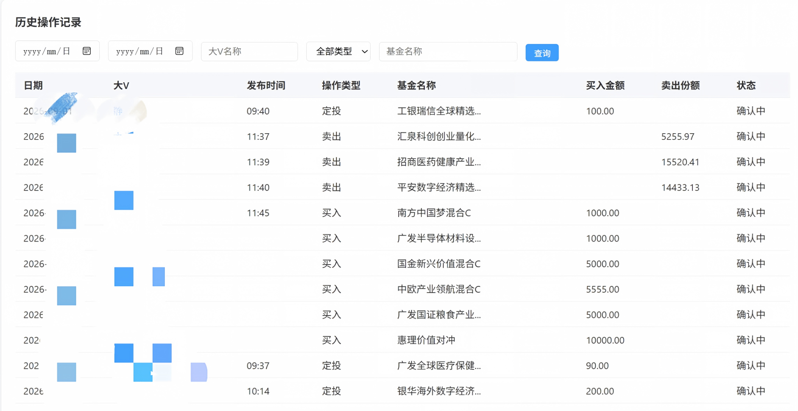
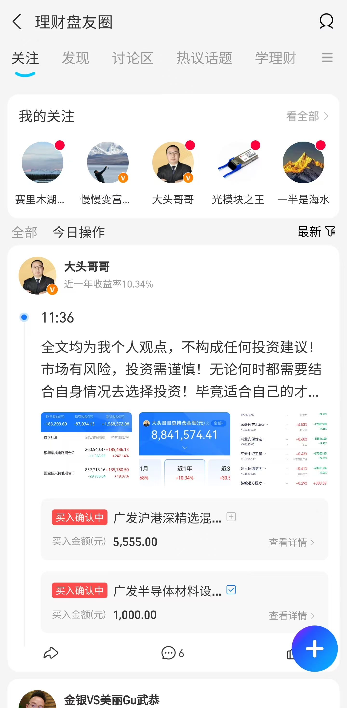

# 蚂蚁大V量化分析

> 蚂蚁财富大V交易行为采集与 AI 分析系统：自动采集每日操作，结构化识别买入 / 卖出 / 定投 / 转换行为，并结合历史数据库分析大V资金变化与方向共识。

**Ant Fortune KOL Trading Tracker & AI Analysis**

---

## 项目简介

理财社区里的大V每天都会公开自己的基金操作，但这些信息通常分散在不同动态中，很难长期追踪和横向比较。

这个项目希望回答几个更实际的问题：

- 今天哪些大V在买？哪些在卖？
- 哪些投资方向正在被多个大V同时关注？
- 某个大V今天买了 5 万，相比他自己过去一周到底算多还是少？
- 某个方向是形成多人共识，还是只有单个大V重仓？
- 大V嘴上看多，但实际资金有没有跟上？
- 某个大V最近是在持续加仓、逐步降温，还是开始出现卖出行为？

目前系统已经形成一条完整链路：

```text
蚂蚁财富 App
      ↓
Android / ADB / UIAutomator
      ↓
页面可见内容采集
      ↓
Raw JSON / Markdown
      ↓
AI 交易结构化识别
      ↓
Excel + MySQL
      ↓
近 7 日历史行为聚合
      ↓
AI 每日分析报告
      ↓
Web Dashboard
```

---

# 效果展示

## 1. 每日市场与大V操作判断

系统会基于当天采集到的大V观点、操作行为和历史基线，生成每日总体判断，并逐个拆解核心大V的操作。



---

## 2. 大V逐笔操作与行为解读

每个大V的买入、卖出、撤销、定投等操作会逐笔展示，同时结合近 7 日历史行为生成状态标签，例如：

- 加仓增强
- 加仓减弱
- 首次买入
- 首次卖出
- 买卖并存
- 撤销后重新布局



也可以识别更复杂的“买入 + 卖出 + 撤销”组合行为：



---

## 3. 方向共识分析

系统会把基金操作聚合到不同投资方向，并同时观察：

- 今日参与大V人数
- 今日买入金额
- 近 7 日人数变化
- 近 7 日金额变化
- 信号类型
- 趋势判断
- 置信度



相比只看“谁买了什么”，更关注：

> **某个投资方向的共识是否正在扩散，以及实际资金有没有同步增强。**

---

## 4. 近 7 日趋势变化

系统会将“大V × 投资方向”与最近 7 个有效采集日进行比较。

例如：

```text
大头哥哥 · 白酒/消费
今日买入：1.01 万
近 7 日均值：0.23 万
变化：+339.1%
→ 加仓显著增强
```



核心原则是：

> **不只看今天买了多少钱，更看今天相对他自己过去的行为发生了什么变化。**

---

## 5. 历史交易记录

所有结构化交易会进入 MySQL，支持按日期、大V、操作类型、基金名称筛选。



这使得后续可以继续做：

- 大V 7 / 30 日行为趋势
- 连续买入 / 卖出分析
- 大V风格变化
- 历史胜率
- 买入后收益回测
- 大V排行榜

---

# 核心能力

## 自动采集大V每日操作

通过真实 Android 设备 + ADB + UIAutomator 获取蚂蚁财富「理财盘友圈」页面数据。

当前支持采集：

- 大V昵称
- 收益率及收益率周期
- 发布时间
- 动态正文
- 买入
- 卖出
- 定投
- 转换
- 撤销
- 买入金额
- 卖出份额
- 评论 / 点赞 / 求解读人数
- 今日操作条数
- 「展开今日全部 N 条操作」

采集过程保留原始 UI 数据，用于重新解析和问题排查。

---

## AI 结构化交易识别

页面原始文本会通过 LLM 转换成结构化交易记录。

核心字段包括：

```text
大V昵称
收益率周期
收益率
发布时间
动态正文
操作类型
操作状态
基金名称
买入金额
卖出份额
转换前基金名称
转换后基金名称
转发数
评论数
点赞数
求解读人数
采集时间
今日操作条数
```

一笔基金操作对应一条记录。

对于无法确认的信息，系统遵循：

> **宁可缺失，不主动编造。**

基金名称如果在原始页面中被截断，则保留原始截断文本。

---

## 最近 7 日行为对比

每日分析不会只看当天绝对值，而是会查询历史数据库，使用分析日前最近 7 个有效采集日期作为行为基线。

例如：

```text
今日买入：50,000 元
近 7 日有效日均买入：120,000 元
变化：-58.3%

判断：
仍然保持买入，但加仓力度明显下降
```

目前可识别：

- 加仓增强
- 加仓减弱
- 持续加仓
- 首次买入
- 停止加仓
- 买卖并存
- 由买转卖
- 由卖转买
- 方向切换

历史样本不足时不会强行判断趋势。

---

## 投资方向聚合

基金会根据名称和规则映射到投资方向。

当前主要包括：

- 半导体 / 科创芯片
- CPO / 光模块
- 全球科技 / QDII
- 黄金
- 资源 / 有色金属
- 债券
- 港股方向
- 白酒 / 消费
- 创新药 / 医药
- 其他 / 待分类

无法可靠判断的基金不会为了凑分类而强行归类。

---

## 两套共识指标

### 按人数

回答：

> 有多少不同大V正在买同一个方向？

同一个大V在同一方向多次操作，只计算一次参与人数。

### 按金额

回答：

> 实际买入资金主要流向哪里？

买入金额由程序确定性计算。

由于原始页面的卖出数据只有“卖出份额”，没有可靠的卖出金额，因此：

> **不同基金的卖出份额不会与买入金额混算，也不会直接计算净资金流。**

---

# 分析原则

项目尽量把“计算”和“解释”分开。

## Python / SQL 负责

```text
今日买入金额
7日均值
7日中位数
变化率
方向买入金额
参与大V人数
连续买入天数
历史有效日期
状态标签
数据完整性
```

## AI 负责

```text
行为解释
趋势总结
共识变化
信号冲突分析
风险提示
自然语言报告
```

核心原则：

> **Python 负责事实和数字，AI 负责理解和解释。**

避免让 LLM 自行计算关键金额、百分比和排名。

---

# 技术架构

| 模块 | 技术 |
| --- | --- |
| Android 数据采集 | ADB / UIAutomator |
| 核心语言 | Python |
| AI 解析 | LLM API |
| 数据处理 | Python |
| 数据库 | MySQL |
| 后端 API | FastAPI |
| 前端 | Vue |
| 数据导出 | Excel / JSON / Markdown |
| 历史分析 | SQL + Python 聚合 |

---

# 数据流

```text
┌─────────────────────┐
│   蚂蚁财富 Android   │
└──────────┬──────────┘
           ↓
┌─────────────────────┐
│ ADB + UIAutomator    │
│ 页面滚动 / 展开操作   │
└──────────┬──────────┘
           ↓
┌─────────────────────┐
│ Raw XML / Raw JSON   │
│ Screen Dump Markdown │
└──────────┬──────────┘
           ↓
┌─────────────────────┐
│      AI Parser       │
│ 非结构化 → 交易记录   │
└──────────┬──────────┘
           ↓
┌──────────────┬──────────────┐
│    Excel     │    MySQL     │
└──────────────┴──────┬───────┘
                      ↓
             ┌────────────────┐
             │ 7日历史行为聚合 │
             └────────┬───────┘
                      ↓
             ┌────────────────┐
             │ AI Daily Report│
             └────────┬───────┘
                      ↓
             ┌────────────────┐
             │ Web Dashboard  │
             └────────────────┘
```

---

# 数据库

核心数据模型：

```text
crawl_runs
kols
posts
operations
```

其中 `operations` 保存交易事实：

```text
kol_id
collect_date
publish_time
operation_type
operation_status
fund_name
buy_amount
sell_shares
remark
original_operation_type
operation_group_id
```

原始数据、结构化数据和最终分析结果相互独立，方便回溯。

---

# 项目特点

## 不是一个简单爬虫

最终目标不是把页面文字保存下来，而是把非结构化理财社区内容转化为：

> **可持续追踪的大V行为数据。**

## 不只分析“今天”

同样都是买入 5 万：

```text
过去每天只买 5,000
→ 今天明显增强
```

```text
过去每天买 20 万
→ 今天明显降温
```

绝对金额相同，含义完全不同。

因此系统使用历史行为作为基线。

## 区分“共识”和“个体行为”

只有单个大V大额买入：

> 个体重仓 / 单点信号

多个大V同时买入且人数、金额同步提升：

> 共识升温 / 共识扩散

避免把一个人的重仓误判成市场共识。

## 原始数据可追溯

系统保留：

```text
原始 UI XML
Raw JSON
Screen Dump Markdown
结构化交易
MySQL 历史记录
AI 每日报告
```

出现错误时可以逐层定位：

```text
采集问题？
↓
可见文本问题？
↓
AI解析问题？
↓
统计问题？
↓
报告解释问题？
```

---

# Roadmap

- [x] Android 页面自动采集
- [x] 页面自动滚动
- [x] 今日全部操作自动展开
- [x] 买入 / 卖出 / 定投 / 转换 / 撤销识别
- [x] AI 结构化交易解析
- [x] Excel 导出
- [x] MySQL 历史存储
- [x] Web 历史交易查询
- [x] AI 每日分析报告
- [x] 最近 7 日行为对比
- [x] 方向共识分析
- [ ] 大V 30 日行为趋势
- [ ] 基金净值数据接入
- [ ] 大V买入后收益跟踪
- [ ] 大V历史胜率分析
- [ ] 大V行为排行榜
- [ ] 投资方向热度指数
- [ ] 自动周报 / 月报
- [ ] AI 自然语言查询
- [ ] 历史交易回测

---

# 长期目标

未来希望这个项目不只是回答：

> 今天哪些大V买了半导体？

而是能够回答：

> 最近一个月哪些大V持续加仓半导体？

> 哪些大V虽然持续表达看多，但实际买入力度正在下降？

> 哪些方向正在从少数人试探，逐渐形成多人资金共识？

> 哪些大V的加仓行为在历史上更具有参考价值？

> 一个大V出现“首次大额买入”后，未来 3 / 7 / 30 天表现怎么样？

最终把理财社区的信息流转化为：

> **可追踪、可比较、可分析、可回测的大V行为数据集。**

---

# 使用说明

> 当前项目仍在持续开发中，部分流程依赖 Android 真机、ADB、蚂蚁财富页面环境以及本地数据库配置。

## 采集起始页面

开始采集前，请先在手机上进入以下页面：

```text
蚂蚁财富 App
  ↓ 底栏「社区」
  ↓ 「看更多」
  ↓ 「今日操作」页面
```

手机停留在此页面后，再启动采集：



建议在运行前准备：

- Python
- Android SDK / ADB
- Android 真机
- MySQL
- LLM API Key
- Node.js（前端）

更详细的安装与启动说明将持续补充。

---

# Disclaimer

本项目仅用于数据分析、AI 技术研究和个人学习。

项目生成的任何分析结果均不构成投资建议，也不代表任何基金、机构或平台观点。

金融市场存在风险，请独立判断并自行承担投资风险。

---

## Star

如果这个项目对你有帮助，欢迎点一个 **Star ⭐**。

也欢迎通过 Issue 一起讨论：

- AI + Quant
- 大V行为分析
- 基金交易数据
- LLM 金融应用
- Android 自动化采集
- 历史行为回测
